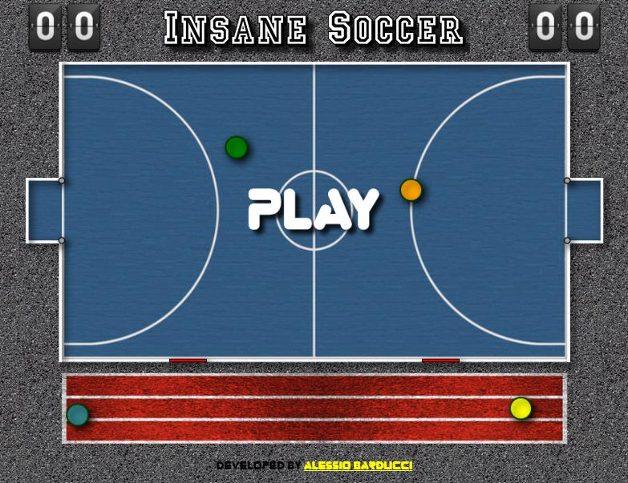

# Insane Soccer 


## Screenshot



## About

**Insane Soccer** is an open-source, browser-based HTML5 soccer game built entirely in **TypeScript**. Play 1-on-1 against a CPU opponent on a top-down pitch rendered through multiple HTML5 Canvas layers.

The game features:
- ⚽ Fast-paced 1v1 soccer gameplay (player vs. CPU)
- 🔥 **Fire Power Shot** — a blazing-fast shot that ignores player bounces and charges straight ahead
- ⚡ **Electric Power Shot** — a precise homing shot that curves toward the goal and stuns any player it hits
- 🌀 Substitute players waiting on the sideline that swap in mid-game
- 🎆 Goal celebrations with fireworks and explosions

## Tech Stack

| Layer | Technology |
|---|---|
| Language | TypeScript |
| Bundler | Webpack |
| Rendering | HTML5 Canvas (multiple layers) |
| Input | Keyboard + Mouse |

## How do I build and run this?

### Prerequisites

- [Node.js](https://nodejs.org/) (v18 or newer recommended) with `npm`

### 1. Clone the repository

```bash
git clone <your-repo-url>
cd Insane Soccer
```

### 2. Install dependencies

```bash
npm install
```

### 3. Start the development server

```bash
npm run start-local
```

This runs Webpack in watch mode and spins up a local HTTP server in parallel.  
Open your browser at **http://localhost:8080** to play.

### 4. Production build

```bash
npm run build
```

The optimised bundle is written to `public/js/game.js`. Serve the `public/` folder with any static file server.

## How do I play this?

1. Open the game in your browser.
2. Move your player to intercept the ball and kick it into the CPU's goal.
3. First player to reach 10 goals wins!

## Controls

| Key | Action |
|---|---|
| `↑` `↓` `←` `→` | Move player |
| `SPACE` | Shot |

## Power Shots

| Shot | Effect |
|---|---|
| 🔥 Fire | 2× speed, passes through bouncing players |
| ⚡ Electric | 1.2× speed, homes toward goal, stuns hit players |

## Project Structure

```
Insane Soccer/
├── public/             # Static assets served to the browser
│   ├── css/            # Stylesheets
│   ├── images/         # Sprites and backgrounds
│   └── index.html      # Game entry point
├── src/
│   ├── assets/         # Asset loading
│   ├── core/           # Game loop
│   ├── game/
│   │   ├── entities/   # Ball, Player, Power Shots, Effects
│   │   ├── enums/      # Game state enums
│   │   ├── geometry/   # Points, movement, border limits
│   │   ├── managers/   # Score & game status
│   │   ├── systems/    # Movement, collision, gate, checker systems
│   │   └── world/      # GameWorld state
│   ├── input/          # Keyboard & mouse input managers
│   ├── rendering/      # Canvas render pipeline
│   ├── ui/             # DOM handling & UI interaction
│   └── utils/          # GameConfigs, EventBus utilities
├── webpack.config.js
└── package.json
```

## Development Scripts

| Command | Description |
|---|---|
| `npm run start-local` | Watch build + local HTTP server (development) |
| `npm run build` | Production bundle via Webpack |
| `npm run typecheck` | TypeScript type-check without emitting |
| `npm run lint` | ESLint check on `src/` |
| `npm run lint:fix` | ESLint auto-fix |
| `npm run format` | Prettier format `src/**/*.ts` |
| `npm run format:check` | Prettier format check |

## Contributing

Contributions are welcome! Feel free to open issues or pull requests.

## License

This project is licensed under the **ISC License**.  
Developed by [Alessio Barducci](http://alessiobarducci.altervista.org).
