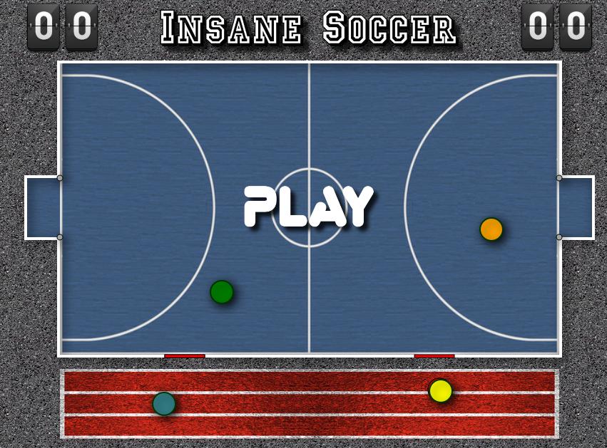

# Insane Soccer 


## Screenshot



## Play

- [alebar12.github.io/insane-soccer/](https://alebar12.github.io/insane-soccer/)

## About

**Insane Soccer** is an open-source, browser-based HTML5 soccer game built entirely in **TypeScript**. Play 1-on-1 against a CPU opponent on a top-down pitch rendered through multiple HTML5 Canvas layers.

The game features:
- Fast-paced 1v1 soccer gameplay (player vs. CPU)
- Power Shots
- Substitute players
- Goal celebrations with fireworks and explosions

## Tech Stack

| Layer | Technology |
|---|---|
| Language | TypeScript 6.x |
| Bundler | Vite |

## How do I build and run this?

### Prerequisites

- [Node.js](https://nodejs.org/) (v18 or newer recommended) with `npm`

### 1. Clone the repository

### 2. Install dependencies

```bash
npm install
```

### 3. Start the development server

```bash
npm run dev
```

This starts the Vite dev server with HMR.
Open your browser at **http://localhost:5173** to play.

### 4. Production build

```bash
npm run build
```

The optimised bundle is written to the `dist/` folder.

### 5. Preview the production build

```bash
npm run preview
```

Serves the `dist/` folder locally so you can verify the production build before deploying.

## How do I play this?

1. Open the game in your browser.
2. Move your player to intercept the ball and kick it into the CPU's goal.
3. First player to reach 10 goals wins!

## Controls

| Key | Action |
|---|---|
| `↑` `↓` `←` `→` | Move player |
| `SPACE` | Shot |

## Development Scripts

| Command | Description |
|---|---|
| `npm run dev` | Start Vite dev server with HMR |
| `npm run build` | Production bundle via Vite |
| `npm run preview` | Serve the production build locally |
| `npm run typecheck` | TypeScript type-check without emitting |
| `npm run lint` | ESLint check on `src/` |
| `npm run lint:fix` | ESLint auto-fix |
| `npm run format` | Prettier format `src/**/*.ts` |
| `npm run format:check` | Prettier format check |

## Contributing

Contributions are welcome! Feel free to open issues or pull requests.
